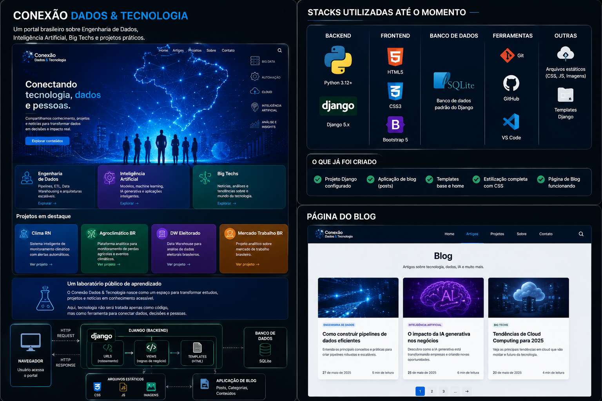

# 🚀 Conexão Dados & Tecnologia

Conectando tecnologia, dados e pessoas.

---

## 📌 Sobre o Projeto

O **Conexão Dados & Tecnologia** é um portal web desenvolvido com **Python + Django** com o objetivo de compartilhar conteúdos sobre:

* Engenharia de Dados
* Inteligência Artificial
* Big Techs
* Automação
* Cloud Computing
* Projetos práticos
* Tendências tecnológicas
* Notícias comentadas

O projeto também funciona como um laboratório público de aprendizado, onde estudos, projetos e experimentos são transformados em conteúdo acessível e didático.

---

## 🖼️ Arquitetura e Stack do Projeto



---

# 🎯 Objetivos do Projeto

O portal foi criado para:

* Consolidar conhecimentos em desenvolvimento web com Django;
* Construir um portfólio profissional;
* Compartilhar estudos e projetos de Engenharia de Dados;
* Publicar notícias comentadas sobre tecnologia;
* Criar um hub brasileiro de conteúdo técnico;
* Integrar blog, projetos e redes sociais;
* Evoluir futuramente para uma plataforma tecnológica completa.

---

# 🧠 Tecnologias Utilizadas

## Backend

* Python
* Django
* SQLite

## Frontend

* HTML5
* CSS3
* Bootstrap 5

## Ferramentas

* VS Code
* Git
* GitHub
* PythonAnywhere (deploy futuro)

---

# 🏗️ Arquitetura do Projeto

```text
Usuário
   ↓
Navegador Web
   ↓
Conexão Dados & Tecnologia
(Django Web Application)
   ↓
Views Django
   ↓
Templates HTML + Bootstrap
   ↓
Banco de Dados SQLite
```

---

# 🖼️ Arquitetura Visual do Projeto

```text
┌────────────────────────────────────┐
│        Usuário / Navegador         │
└────────────────────────────────────┘
                  ↓
┌────────────────────────────────────┐
│    Conexão Dados & Tecnologia      │
│         Portal em Django           │
└────────────────────────────────────┘
                  ↓
┌────────────────────────────────────┐
│            URLs Django             │
└────────────────────────────────────┘
                  ↓
┌────────────────────────────────────┐
│           Views Django             │
└────────────────────────────────────┘
                  ↓
┌────────────────────────────────────┐
│      Templates HTML + CSS          │
│           Bootstrap 5              │
└────────────────────────────────────┘
                  ↓
┌────────────────────────────────────┐
│           Banco SQLite             │
└────────────────────────────────────┘
```

---

# 📂 Estrutura do Projeto

```text
conexao-dados-tecnologia/
│
├── blog/
│   ├── migrations/
│   ├── admin.py
│   ├── apps.py
│   ├── models.py
│   ├── tests.py
│   ├── urls.py
│   └── views.py
│
├── config/
│   ├── settings.py
│   ├── urls.py
│   ├── asgi.py
│   └── wsgi.py
│
├── static/
│   ├── css/
│   │   └── style.css
│   ├── img/
│   └── js/
│
├── templates/
│   ├── base.html
│   ├── home.html
│   ├── sobre.html
│   ├── projetos.html
│   └── contato.html
│
├── .venv/
├── manage.py
├── requirements.txt
├── README.md
└── .gitignore
```

---

# 🎨 Identidade Visual

## Paleta de cores

* Azul escuro
* Azul tecnológico
* Branco
* Cinza claro
* Verde tecnológico
* Roxo tecnológico

## Estilo visual

* Moderno
* Tecnológico
* Responsivo
* Inspirado em portais tech
* Interface clean e profissional

---

# 🏠 Funcionalidades Implementadas

## Homepage profissional

* Hero section com banner tecnológico
* Navbar responsiva
* Cards tecnológicos
* Projetos em destaque
* Rodapé institucional
* Copyright

## Páginas criadas

* Home
* Sobre
* Projetos
* Contato

## Interface moderna

* Bootstrap 5
* CSS customizado
* Cards animados
* Hover effects
* Responsividade

---

# 🧪 Projetos em Destaque

## 🌦️ Clima RN

Sistema inteligente de monitoramento climático com alertas automatizados.

## 🌱 Observatório Agroclimático BR

Plataforma analítica para monitoramento de perdas agrícolas e eventos climáticos.

## 🗳️ DW Eleitorado Brasil

Data Warehouse para análise de dados eleitorais brasileiros.

## 💼 DW Mercado de Trabalho Brasil

Projeto analítico sobre mercado de trabalho brasileiro.

---

# ⚙️ Como Executar o Projeto

## 1. Clonar o repositório

```bash
git clone https://github.com/SEU-USUARIO/conexao-dados-tecnologia.git
```

---

## 2. Entrar na pasta

```bash
cd conexao-dados-tecnologia
```

---

## 3. Criar ambiente virtual

```bash
python -m venv .venv
```

---

## 4. Ativar ambiente virtual

### Windows

```bash
.venv\Scripts\activate
```

---

## 5. Instalar dependências

```bash
pip install -r requirements.txt
```

---

## 6. Rodar migrações

```bash
python manage.py migrate
```

---

## 7. Rodar servidor

```bash
python manage.py runserver
```

---

## 8. Abrir no navegador

```text
http://127.0.0.1:8000/
```

---

# 🔮 Próximas Implementações

## Blog real

* Sistema de artigos
* Categorias
* Tags
* Imagens destacadas
* Página individual do artigo

## Integrações

* LinkedIn
* WhatsApp
* Medium
* Instagram

## Melhorias futuras

* Dark mode
* Sistema de comentários
* Busca
* Newsletter
* SEO avançado
* Deploy no PythonAnywhere
* Dashboard administrativo

---

# 🌐 Futuro do Projeto

O objetivo é transformar o Conexão Dados & Tecnologia em:

```text
Portal tecnológico
+
Laboratório de Engenharia de Dados
+
Hub de IA
+
Central de projetos reais
+
Plataforma de conteúdo técnico
```

---

# 👨‍💻 Autor

## Lúcio Fábio Barbosa de Lima

Estudante de Análise e Desenvolvimento de Sistemas.

Estudante Full Stack em Dados e Analytics - Pod Academy

foco em:

* Engenharia de Dados
* Inteligência Artificial
* Automação
* Desenvolvimento Web
* Projetos tecnológicos

---

# 📢 Redes Futuras

* LinkedIn
* GitHub
* Instagram
* Medium
* WhatsApp Channel

---

# 📄 Licença

Projeto desenvolvido para fins educacionais, profissionais e de portfólio.

---

# ⭐ Conexão Dados & Tecnologia

> Conectando tecnologia, dados e pessoas.
